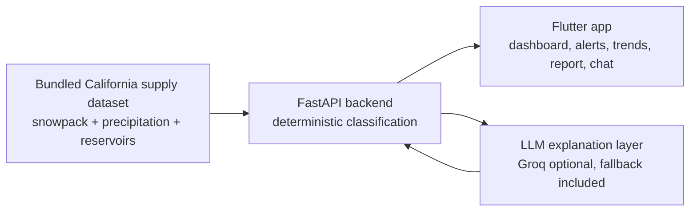

# Hydra

**California water-supply intelligence — three signals, one clear outlook.**

Hydra is a Flutter + FastAPI hackathon project built for the H2O Hackathon's water-supply challenge. It reads California snowpack, precipitation, and reservoir storage together, classifies each signal against threshold bands, and turns the combined outlook into clear planning guidance for citizens, farmers, and supply managers.

> Snowpack alone is no longer enough. Hydra explains the whole water story at a glance.


## Why It Exists

The 2026 H2O Hackathon asked students to build tools that help communities understand California's water supply. The event, hosted at the San Joaquin County Office of Education on May 2, 2026, challenged teams to use technology, creativity, and problem-solving to make water data more understandable and actionable.

Hydra focuses on one core idea: California's water outlook cannot be understood from one metric. A healthy reservoir level can hide weak future snowpack. Normal precipitation can arrive as rain instead of stored mountain snow. Full reservoirs can become an overflow risk when major storms arrive.

## What Hydra Does

| Product surface | What it answers |
| --- | --- |
| **Outlook** | Is California's water supply strong, stable, watch-level, or concerning? |
| **Alerts** | What multi-signal patterns should people notice now? |
| **Trends** | How have snowpack, precipitation, and reservoirs moved across the dataset? |
| **History** | Which years were strong, mixed, or weak in context? |
| **Report** | What improved, what worsened, and what still needs attention? |
| **Planning** | What does this mean for citizens, farmers, and supply managers? |

## Demo Flow

1. Open the dashboard and read the combined outlook.
2. Compare the three metric tiles: snowpack, precipitation, and reservoir storage.
3. Review active alerts for mixed-signal water risk.
4. Open trends to see the decade-level context.
5. Use the report screen for a plain-language summary.
6. Ask Hydra questions through the chat panel.

## Architecture



## Deterministic vs. AI

Hydra keeps numerical judgment auditable. The LLM explains the data in plain language, but it does not decide classifications, alert severity, projections, or planning guidance.

| Concern | Location | AI? |
| --- | --- | --- |
| Signal band classification | `backend/app/services/supply_service.py` | No |
| Combined outlook label | `backend/app/services/supply_service.py` | No |
| Multi-signal alert triggering | `backend/app/services/alert_service.py` | No |
| Historical year labels | `backend/app/services/historical_service.py` | No |
| Projection model | `backend/app/services/projection_service.py` | No |
| Planning guidance | `backend/app/services/planning_service.py` | No |
| Plain-language summaries | `backend/app/services/llm_service.py` | Optional |

Every AI surface has an offline fallback, so the demo still works without an API key.

## Repository Layout

```text
projectH2O/
├── backend/        FastAPI API, deterministic services, tests, bundled data
├── frontend/       Flutter app for web/mobile
├── presentation/   Hackathon presentation deck
├── PRESENTATION.md Full project narrative and demo script
└── README.md       Repo overview
```

## Run the Backend

```bash
cd backend
python -m venv .venv
source .venv/bin/activate
pip install -r requirements.txt
cp .env.example .env
uvicorn app.main:app --reload --port 8000
```

Optional: add `GROQ_API_KEY` in `backend/.env` for live AI explanations. Without it, Hydra uses deterministic fallback copy.

Useful endpoints:

- Health: `http://localhost:8000/health`
- API docs: `http://localhost:8000/docs`
- Supply dashboard data: `http://localhost:8000/supply/dashboard`

## Run the Frontend

```bash
cd frontend
flutter pub get
flutter run -d chrome --dart-define=HYDROSENSE_API_BASE_URL=http://localhost:8000
```

For the Android emulator, use:

```bash
flutter run --dart-define=HYDROSENSE_API_BASE_URL=http://10.0.2.2:8000
```

## Tests

```bash
cd backend
source .venv/bin/activate
pytest tests/ -q
```

The backend test suite covers signal band classification, combined outlook logic, historical labeling, and multi-signal alert patterns.

## Hackathon Context

The Ninth Annual H2O Hackathon was a community-supported coding and multimedia competition for high school and college students focused on California water issues. SJCOE reported that about 200 students on 58 teams competed on May 2, 2026, building apps and campaigns to help local communities understand the state's changing water situation.

Sources:

- [SJCOE registration announcement](https://www.sjcoe.org/post-detail/~board/newsroom/post/registration-open-for-2026-h2o-hackathon-coding-and-multimedia-competition)
- [SJCOE winners announcement](https://www.sjcoe.org/post-detail/~board/newsroom/post/winners-of-ho-hackathon-announced)

## Security Note

Do not commit real API keys. Use `backend/.env.example` as the template and keep local secrets in `backend/.env`, which is ignored by git.

## License

MIT
