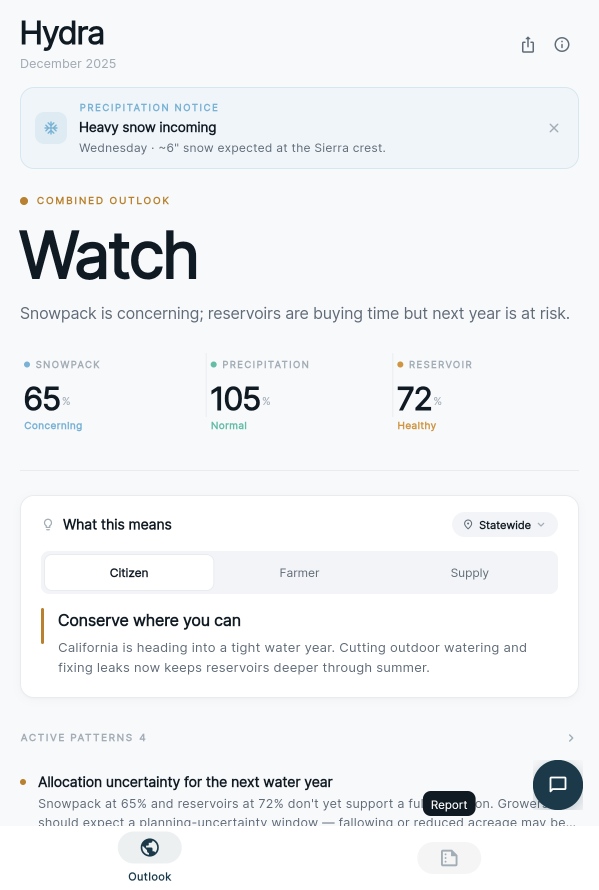
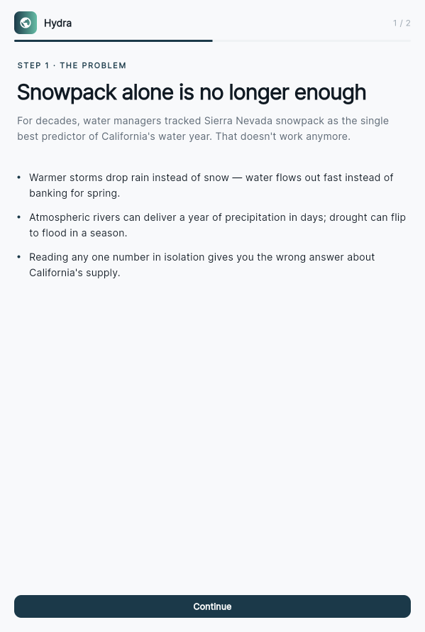
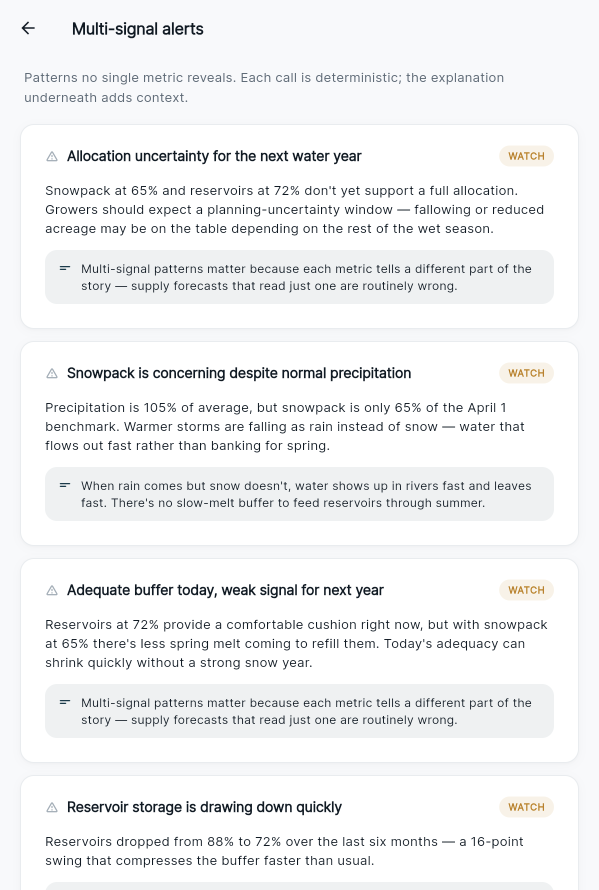
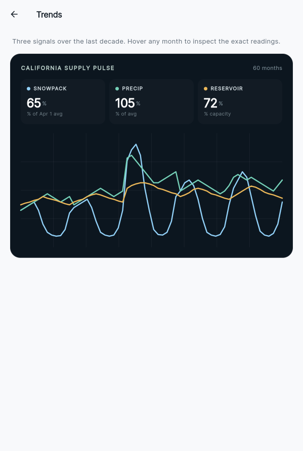
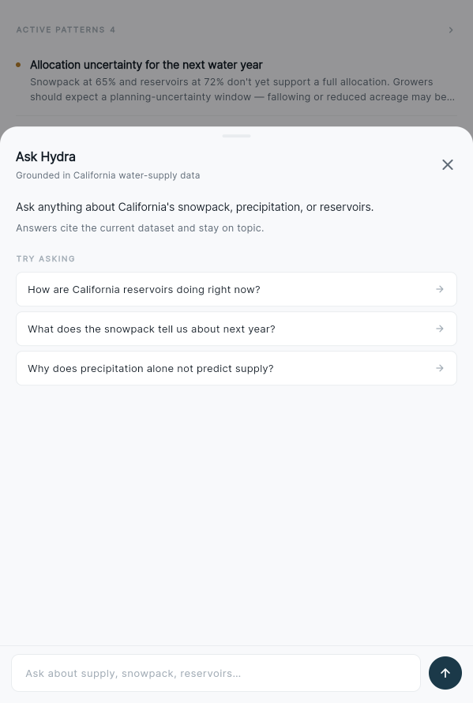
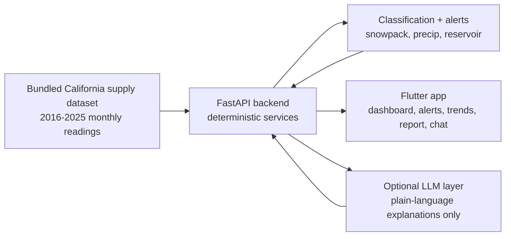

<div align="center">

# Hydra

### California water-supply intelligence — three signals, one clear outlook.

Hydra is a Flutter + FastAPI hackathon app that reads California **snowpack**, **precipitation**, and **reservoir storage** together, then translates the combined signal into planning guidance, alerts, trends, and AI-assisted explanations.


<br />



**Snowpack alone is no longer enough. Hydra shows the whole water story.**

</div>

## Screenshots

Real screenshots captured from the running Flutter web app against the local FastAPI backend.

| Home / onboarding | Dashboard | Multi-signal alerts |
| --- | --- | --- |
|  |  |  |

| Trends visualization | Ask Hydra |
| --- | --- |
|  |  |

## Built For H2O Hackathon

Hydra was built for the H2O Hackathon's water-supply challenge: help communities understand California water conditions through technology, data, and clear communication.

The project centers on the challenge's key insight: modern water supply cannot be forecast from one number. Snowpack, precipitation, and reservoir storage can disagree, and the disagreement is often the point. Hydra turns those mixed signals into an outlook a citizen, farmer, or supply manager can act on.

Sources:

- [SJCOE registration announcement](https://www.sjcoe.org/post-detail/~board/newsroom/post/registration-open-for-2026-h2o-hackathon-coding-and-multimedia-competition)
- [SJCOE winners announcement](https://www.sjcoe.org/post-detail/~board/newsroom/post/winners-of-ho-hackathon-announced)

## Problem

California's water story used to be easier to summarize: watch the Sierra Nevada snowpack, then infer the coming water year. That single-signal story is breaking down.

- Warmer storms can drop rain instead of snow.
- Atmospheric rivers can swing the state from drought pressure to flood pressure quickly.
- Reservoirs can look healthy today while weak snowpack raises next-season risk.
- Public users need consequences, not raw percentages.

## Solution

Hydra combines three official-style water signals into one auditable product experience:

- **Combined outlook:** Strong, Stable, Watch, or Concern.
- **Metric cards:** snowpack, precipitation, and reservoir readings with severity labels.
- **Precipitation notice:** upcoming water events surfaced at the top of the dashboard.
- **Planning card:** citizen, farmer, and supply-manager implications.
- **Multi-signal alerts:** patterns that are invisible when reading one metric alone.
- **Trends view:** decade-level charting across all three signals.
- **Ask Hydra:** AI-assisted explanation grounded in the project dataset.

The AI layer explains. It does not classify, score, or decide.

## Feature Highlights

| Feature | Why it matters |
| --- | --- |
| **Watch outlook** | The app can show that reservoirs are buying time while weak snowpack raises future risk. |
| **Active patterns** | Alerts identify allocation uncertainty, low snow despite normal precipitation, and reservoir drawdown. |
| **Trend chart** | The chart lets users compare snowpack, precipitation, and reservoirs in one visual field. |
| **Audience planning** | The same water data becomes different advice for citizens, farmers, and supply managers. |
| **Offline AI fallback** | The demo remains coherent even without an API key. |

## Tech Stack

| Layer | Tools |
| --- | --- |
| Frontend | Flutter, Riverpod, dio, fl_chart, Material UI |
| Backend | Python, FastAPI, Pydantic, pytest |
| AI explanations | Groq API optional, deterministic fallback required |
| Data | Bundled California supply dataset, 2016-2025 |
| Delivery | Vercel Flutter web + FastAPI serverless API, GitHub Actions backend tests |

## Architecture



## Deterministic vs. AI

| Concern | Location | AI? |
| --- | --- | --- |
| Signal band classification | `backend/app/services/supply_service.py` | No |
| Combined outlook label | `backend/app/services/supply_service.py` | No |
| Multi-signal alert triggering | `backend/app/services/alert_service.py` | No |
| Historical year labels | `backend/app/services/historical_service.py` | No |
| Projection model | `backend/app/services/projection_service.py` | No |
| Planning guidance | `backend/app/services/planning_service.py` | No |
| Plain-language summaries and chat | `backend/app/services/llm_service.py` | Optional |

Every AI surface has an offline fallback, so the app still works without a live model key.

## Repository Layout

```text
projectH2O/
├── assets/screenshots/  Real app screenshots used in this README
├── backend/             FastAPI API, deterministic services, tests, bundled data
├── frontend/            Flutter app for web/mobile
├── presentation/        Hackathon presentation deck
├── docs/                Hackathon context and supporting notes
├── PRESENTATION.md      Pitch, demo script, architecture, roadmap
└── README.md            Visual project overview
```

## Setup

### Backend

The backend FastAPI app lives in `backend/app/main.py`. For local development,
`backend/main.py` re-exports the same app so the standard `uvicorn main:app`
command works from inside the backend folder.

```bash
cd backend
python -m venv .venv
source .venv/bin/activate
pip install -r requirements.txt
cp .env.example .env
uvicorn main:app --reload --host 127.0.0.1 --port 8000
```

`GROQ_API_KEY` is optional. Leave it as a placeholder or empty for fallback explanations. Do not commit real keys.

Useful endpoints:

- Health: `http://localhost:8000/health`
- API docs: `http://localhost:8000/docs`
- Supply dashboard data: `http://localhost:8000/supply/dashboard`

### Vercel Deployment

This repo deploys the Flutter web app at the public root and keeps FastAPI under
`/api`. Vercel runs `scripts/vercel-build-flutter.sh`, which installs Flutter,
builds `frontend/build/web`, and compiles the web app with
`HYDROSENSE_API_BASE_URL=/api`.

- Website: `https://<your-vercel-domain>/`
- API health: `https://<your-vercel-domain>/api/health`
- API docs: `https://<your-vercel-domain>/api/docs`
- Dashboard data: `https://<your-vercel-domain>/api/supply/dashboard`
- Chatbot: `https://<your-vercel-domain>/api/supply/chat`

The thin Vercel adapter at `api/index.py` imports the existing backend app and
mounts it under `/api`. Backend logic still lives in `backend/app`.

Vercel installs Python dependencies from the root `requirements.txt`. Keep it
in sync with `backend/requirements.txt` when backend packages change.

Deploy from GitHub:

1. Import `https://github.com/SoojalKumar/projectH2O` into Vercel.
2. Use the repository root as the project root.
3. Let `vercel.json` provide the build command and output directory.
4. Add environment variables in Vercel Project Settings:

| Name | Required? | Value |
| --- | --- | --- |
| `GROQ_API_KEY` | No | Optional Groq key for live AI explanations. Leave unset for deterministic fallbacks. |
| `LLM_MODEL` | No | Defaults to `llama-3.3-70b-versatile`. |
| `APP_HOST` | No | Local-only; not needed on Vercel. |
| `APP_PORT` | No | Local-only; not needed on Vercel. |

Deploy with the CLI:

```bash
vercel
vercel --prod
```

Local Vercel-style API check:

```bash
uvicorn api.index:app --host 127.0.0.1 --port 8020
open http://127.0.0.1:8020/api/docs
```

### Frontend

```bash
cd frontend
flutter pub get
flutter run -d chrome --dart-define=HYDROSENSE_API_BASE_URL=http://localhost:8000
```

For Android emulator:

```bash
flutter run --dart-define=HYDROSENSE_API_BASE_URL=http://10.0.2.2:8000
```

For a deployed Vercel API, point the Flutter app at the `/api` base:

```bash
flutter run -d chrome --dart-define=HYDROSENSE_API_BASE_URL=/api
```

Production web build:

```bash
cd frontend
flutter build web --release --base-href / --dart-define=HYDROSENSE_API_BASE_URL=/api
```

## Demo Flow

1. Start on onboarding: "Snowpack alone is no longer enough."
2. Continue into the dashboard and read the combined **Watch** outlook.
3. Compare the three metrics: **65% snowpack**, **105% precipitation**, **72% reservoir**.
4. Open multi-signal alerts to see why normal precipitation does not cancel low snowpack.
5. Open trends for the decade-level water-supply chart.
6. Ask Hydra a question from the chat panel.
7. Move to the report tab for a plain-language synthesis.

## Tests

```bash
cd backend
source .venv/bin/activate
pytest tests/ -q
```

Current backend suite: **34 passing tests** covering band classification, outlook logic, API routes, Vercel routing, historical labeling, and alert patterns.

## Future Improvements

- Connect live California water APIs with caching and provenance labels.
- Add map-based regional comparisons for watersheds and reservoir systems.
- Export share cards and judge-friendly PDF summaries.
- Add calibrated forecast confidence bands as more training data becomes available.
- Expand multilingual chat with citations to exact dataset rows.

## Security Note

Do not commit `.env`, API keys, local virtualenvs, Flutter build folders, or generated cache files. Use `backend/.env.example` as the safe template.

## License

MIT
